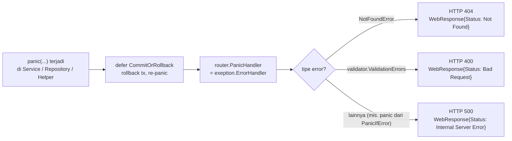

# Arsitektur Aplikasi — Layered Architecture (Golang RESTful API)

Dokumen ini menjelaskan pola arsitektur yang dipakai di project ini:
**Route → Controller → Service → Repository → Database**, beserta alur
request nyata untuk resource `Category`.

## 1. Gambaran Umum

Project ini adalah REST API sederhana (single resource: `Category`, CRUD
penuh) yang dibangun dengan:

| Komponen | Library / Tool |
|---|---|
| HTTP Router | [`julienschmidt/httprouter`](https://github.com/julienschmidt/httprouter) |
| Database Driver | `database/sql` + [`go-sql-driver/mysql`](https://github.com/go-sql-driver/mysql) |
| Validasi Input | [`go-playground/validator`](https://github.com/go-playground/validator) |
| Dokumentasi API | `swaggo/swag` + `http-swagger` (lihat `docs/swagger.yaml`) |
| Konfigurasi | `.env` via `joho/godotenv` |

Arsitekturnya mengikuti pola **layered / n-tier**, di mana setiap layer
hanya boleh bicara dengan layer tepat di bawahnya melalui **interface**
(bukan struct konkret). Ini membuat setiap layer bisa di-mock dan diuji
secara terpisah (lihat folder `test/`).

```
main.go  (composition root — di sinilah semua layer "dirakit")
   │
   ▼
app.NewRouter(controller)        ─┐
   │                              │  Wiring / Dependency Injection
   ▼                              │
controller.NewCategoryController │
   │                              │
   ▼                              │
service.NewCategoryService       │
   │                              │
   ▼                              │
repository.NewCategoryRepository ─┘
```

## 2. Diagram Alur: Route → Controller → Service → Repository → DB

```mermaid
flowchart TD
    Client(["🌐 Client<br/>(curl / Postman / Browser)"])

    subgraph L1["1️⃣ Router — app/router.go"]
        Router["httprouter.Router<br/>mencocokkan method + path,<br/>ekstrak path params (:categoryId)"]
    end

    subgraph L2["2️⃣ Controller — controller/category_controller_impl.go"]
        Controller["CategoryControllerImpl<br/>• decode JSON body → struct request<br/>• parse path param<br/>• bungkus hasil ke WebResponse<br/>• encode JSON response"]
    end

    subgraph L3["3️⃣ Service — service/category_service_impl.go"]
        Validate["validator.Struct(request)<br/>validasi tag `validate:\"...\"`"]
        Tx["DB.Begin() → tx<br/>defer helper.CommitOrRollback(tx)"]
        Business["Business logic:<br/>domain.Category ⇄ web.*Request/Response<br/>(mapping via helper/model.go)"]
    end

    subgraph L4["4️⃣ Repository — repository/category_repository_impl.go"]
        Repo["CategoryRepositoryImpl<br/>bangun SQL string,<br/>tx.ExecContext / tx.QueryContext,<br/>scan rows → domain.Category"]
    end

    subgraph L5["5️⃣ Database"]
        DB[("MySQL<br/>tabel category")]
    end

    Client -- "HTTP Request" --> Router
    Router -- "dispatch ke handler method" --> Controller
    Controller -- "web.CategoryCreateRequest / \nweb.CategoryUpdateRequest / categoryId" --> Validate
    Validate --> Tx
    Tx --> Business
    Business -- "domain.Category + *sql.Tx + ctx" --> Repo
    Repo -- "SQL query/exec" --> DB
    DB -- "rows / result" --> Repo
    Repo -- "domain.Category / []domain.Category" --> Business
    Business -- "web.CategoryResponse" --> Controller
    Controller -- "JSON (web.WebResponse)" --> Client

    style Client fill:#eef,stroke:#446
    style DB fill:#efe,stroke:#484
```

**Aturan kunci pola ini:**

- **Setiap layer bergantung pada interface, bukan implementasi.**
  `CategoryController`, `CategoryService`, `CategoryRepository` semuanya
  didefinisikan sebagai interface (file `*_controller.go`,
  `*_service.go`, `*_repository.go`), lalu diimplementasikan di file
  `*_impl.go`. Ini memungkinkan dependency injection manual di `main.go`.
- **Transaction dimulai & ditutup di Service**, bukan di Controller atau
  Repository. Service memanggil `DB.Begin()`, lalu `defer
  helper.CommitOrRollback(tx)` — Repository hanya menerima `*sql.Tx` yang
  sudah aktif, tidak pernah membuka transaksi sendiri.
- **Konversi domain ⇄ DTO terjadi di Service**, memakai helper
  `ToCategoryResponse` / `ToCategoryResponses` (`helper/model.go`).
  Repository hanya bekerja dengan `domain.Category` (struct murni,
  merepresentasikan baris tabel); Controller hanya bekerja dengan
  `web.*Request` / `web.*Response` (struct untuk kontrak API/JSON).
- **Tidak ada `error` yang dikembalikan berantai ke atas** — project ini
  memakai pola **panic/recover**: helper `PanicIfError` melempar panic
  begitu ada error teknis, lalu `router.PanicHandler = exeption.ErrorHandler`
  menangkapnya secara terpusat di satu tempat.

## 3. Wiring / Dependency Injection (`main.go`)

Semua layer dirakit secara manual (tanpa DI framework) di `main.go`,
dari bawah ke atas:

```
repository := repository.NewCategoryRepository()
service    := service.NewCategoryService(repository, db, validate)
controller := controller.NewCategoryController(service)
router     := app.NewRouter(controller)
```

Karena setiap `New...` menerima interface dari layer bawahnya sebagai
parameter, layer atas **tidak tahu-menahu implementasi konkret** layer
bawahnya — hanya tahu kontraknya (interface).

## 4. Alur Request Konkret: `GET /api/categories/5`

1. **Client** mengirim `GET /api/categories/5`.
2. **Router** (`app/router.go`) mencocokkan pola `/api/categories/:categoryId`
   dan memanggil `categoryController.FindById`, dengan `categoryId=5`
   tersedia lewat `httprouter.Params`.
3. **Controller** (`category_controller_impl.go:103-118`) mem-parse
   `categoryId` string → `int`, lalu memanggil
   `categoryService.FindById(ctx, 5)`.
4. **Service** (`category_service_impl.go:79-91`):
   - Membuka transaksi: `DB.Begin()`.
   - `defer helper.CommitOrRollback(tx)` — akan commit di akhir, atau
     rollback + re-panic bila terjadi panic di dalamnya.
   - Memanggil `categoryRepository.FindById(ctx, tx, 5)`.
5. **Repository** (`category_repository_impl.go:44-58`) menjalankan
   `SELECT * FROM categories WHERE id = ?`, men-scan baris pertama ke
   `domain.Category`, mengembalikan `(category, nil)` — atau
   `(Category{}, errors.New("category not found"))` bila tidak ada baris.
6. **Kembali ke Service**: bila `err != nil`, Service melakukan
   `panic(exeption.NewNotFoundError(err.Error()))` — transaksi otomatis
   di-rollback oleh `CommitOrRollback` sebelum panic diteruskan.
   Bila ditemukan, Service mengonversi `domain.Category` →
   `web.CategoryResponse` lewat helper.
7. **Controller** membungkus hasil ke `web.WebResponse{Code:200, ...}`
   dan menulisnya sebagai JSON lewat `helper.WriteToResponseBody`.
8. **Client** menerima JSON response.

### Jalur Error (panic → ErrorHandler)



Semua error, baik dari validasi input, data tidak ditemukan, maupun
error teknis (koneksi DB gagal, dsb.), berakhir di satu tempat:
`exeption/error_handler.go`. Tidak ada `if err != nil { return err }`
berantai seperti pada pola Go idiomatik biasa — ini pilihan desain yang
umum dipakai di tutorial ini untuk menyederhanakan kode, dengan trade-off
performa panic/recover yang sedikit lebih mahal dibanding error return
biasa.

## 5. Peta File per Layer

| Layer | Interface | Implementasi | Tanggung Jawab |
|---|---|---|---|
| Router | — | `app/router.go` | Routing HTTP method+path → handler, daftar `PanicHandler` |
| Controller | `controller/category_controller.go` | `controller/category_controller_impl.go` | Parsing HTTP request/response, tidak ada business logic |
| Service | `service/category_service.go` | `service/category_service_impl.go` | Validasi, transaksi, business logic, mapping domain⇄DTO |
| Repository | `repository/category_repository.go` | `repository/category_repository_impl.go` | Query SQL murni, mapping row⇄domain |
| Model | `model/domain/category.go` | — | Representasi tabel `category` |
| Model | `model/web/*.go` | — | Kontrak request/response JSON (DTO) |
| Helper | `helper/*.go` | — | `PanicIfError`, `CommitOrRollback`, JSON encode/decode, domain→DTO mapper |
| Exception | `exeption/*.go` | — | `NotFoundError` + `ErrorHandler` terpusat |

## 6. Catatan / Hal yang Perlu Diperhatikan

Karena ini project belajar, ada beberapa hal kecil yang baik diketahui
(bukan diperbaiki otomatis — cukup jadi catatan pembelajaran):

- **Mismatch nama tabel**: migrasi (`db/migrations/*.up.sql`) membuat
  tabel bernama `category` (tunggal), tapi seluruh query di
  `repository/category_repository_impl.go` menyebut `categories` (jamak).
  Ini akan menyebabkan error SQL `Table 'categories' doesn't exist` saat
  runtime jika migrasi dijalankan apa adanya — nama tabel di salah satu
  sisi perlu diseragamkan.
- **Panggilan ganda di Controller**: `FindById` dan `FindAll` di
  `category_controller_impl.go` memanggil method service-nya dua kali
  (baris hasil pertama dibuang, dipanggil ulang). Tidak menyebabkan bug
  fungsional, tapi query ke DB jalan dua kali per request — sebaiknya
  baris pemanggilan yang duplikat dihapus.
- **Typo tag validasi**: `CategoryUpdateRequest.Name`
  (`model/web/category_update_request.go`) memakai tag
  `validate:"requeid,..."` — seharusnya `required`. Karena typo ini,
  validasi "wajib diisi" untuk field `Name` saat update **tidak
  benar-benar berjalan**.

---
*Dihasilkan dari analisis langsung terhadap source code di
`main.go`, `app/`, `controller/`, `service/`, `repository/`,
`model/`, `helper/`, `exeption/`, dan `db/migrations/`.*
